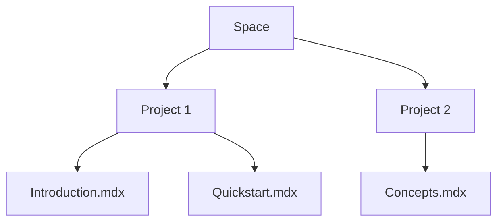

## Overview

Divesh FX organizes your project documentation into structured spaces. You create documentation spaces to group related projects, establish page hierarchies for navigation, manage permissions for collaboration, and integrate with workflows like GitHub or CI/CD pipelines. Master these concepts to build scalable documentation.

<Callout kind="info">
  Start with a documentation space for each major project to keep content organized.
</Callout>

## Core Concepts

Explore the foundational building blocks through these key areas.

<Columns cols={2}>
  <Card title="Documentation Spaces" icon="folder" href="#documentation-spaces">
    Group projects into isolated spaces with custom branding and settings.
  </Card>
  <Card title="Page Hierarchy" icon="layout" href="#page-hierarchy">
    Nest pages and sections for intuitive navigation.
  </Card>
  <Card title="Permissions" icon="shield" href="#permissions">
    Control access at space, project, and page levels.
  </Card>
  <Card title="Workflow Integration" icon="git-branch" href="#workflows">
    Sync docs with your development pipelines.
  </Card>
</Columns>

## Documentation Spaces and Projects

Documentation spaces act as top-level containers. You create a space for each product or team, then add projects within it. Each space supports custom themes using colors like `#3B82F6`.

### Create Your First Space

<Steps>
  <Step title="Navigate to Spaces" icon="search">
    Go to your Divesh FX dashboard and select `Create New Space`.
  </Step>
  <Step title="Configure Settings">
    Enter a name, description, and brand color. Enable Git integration if needed.
  </Step>
  <Step title="Add Projects">
    Inside the space, create projects like `API Docs` or `User Guide`.
  </Step>
</Steps>

## Page Hierarchy

Pages form a tree structure. Use frontmatter in MDX files to define titles and navigation.



<CodeGroup tabs="MDX,YAML">
  ```mdx
  ---
  title: Quickstart
  description: Get started fast.
  ---
  ## Overview
  ```
  ```yaml
  # Navigation config example
  spaces:
    - name: My Project
      projects:
        - pages:
          - title: Introduction
            path: introduction.mdx
          - title: Quickstart
            path: quickstart.mdx
  ```
</CodeGroup>

## Permissions and Access Levels

Control who views, edits, or admins content. Assign roles like Viewer, Editor, or Owner.

| Role     | View | Edit | Delete | Admin |
|----------|------|------|--------|-------|
| Viewer   | ✅   | ❌   | ❌     | ❌    |
| Editor   | ✅   | ✅   | ❌     | ❌    |
| Owner    | ✅   | ✅   | ✅     | ✅    |

<Callout kind="alert">
  Always set least-privilege permissions. Use groups for teams.
</Callout>

<Tabs>
  <Tab title="Space Level" icon="users">
    Manage access for entire spaces via the settings panel.
  </Tab>
  <Tab title="Page Level" icon="key">
    Override with page-specific locks using frontmatter.
  </Tab>
</Tabs>

## Workflow Integration

Connect Divesh FX to GitHub, GitLab, or Vercel. Push changes trigger auto-builds and deployments.

<Expandable title="Advanced GitHub Integration" default-open="false">
  Configure webhooks to sync pull requests with preview docs.

  ```yaml
  # .github/workflows/docs.yml
  name: Build Docs
  on: [push, pull_request]
  jobs:
    deploy:
      runs-on: ubuntu-latest
      steps:
        - uses: actions/checkout@v4
        - name: Deploy to Divesh FX
          run: curl -X POST https://api.example.com/deploy \
            -H "Authorization: Bearer YOUR_TOKEN" \
            -d '{"space": "my-space"}'
  ```
</Expandable>

These concepts form the backbone of Divesh FX. Apply them to streamline your documentation process. For hands-on practice, explore the [quickstart](/quickstart).