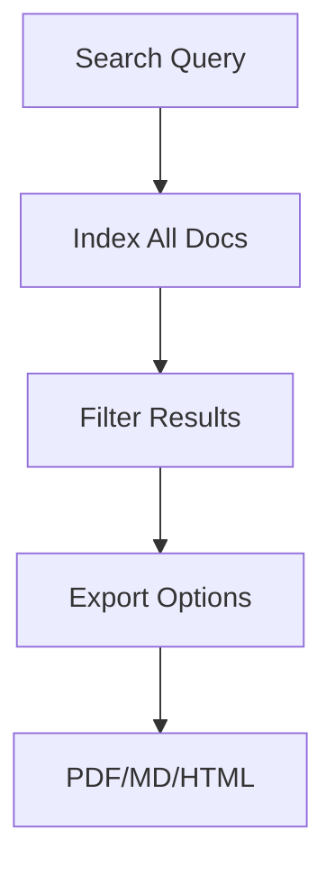

## Overview

Divesh FX provides powerful tools to manage your project documentation efficiently. You organize content into folders, collaborate with teams in real-time, track changes with version control, and search or export documents easily. These features streamline your workflow from creation to sharing.

<Columns cols={2}>
  <Card title="Document Organization" icon="folder" href="#document-organization">
    Structure your docs hierarchically with folders and subfolders.
  </Card>
  <Card title="Team Collaboration" icon="users" href="#team-collaboration">
    Invite teammates and work together seamlessly.
  </Card>
  <Card title="Version Control" icon="git-branch" href="#version-control">
    Track changes and revert to previous versions effortlessly.
  </Card>
  <Card title="Search and Export" icon="search" href="#search-export">
    Find content quickly and export in multiple formats.
  </Card>
</Columns>

## Document Organization and Folders

Organize your documentation into intuitive folder structures. Create nested folders to group related pages, making navigation simple for you and your team.

<Steps>
  <Step title="Create a Folder" icon="plus">
    Use the API or UI to add a new folder.

````javascript
fetch("https://api.example.com/docs/v1/folders", {
  method: "POST",
  headers: {
    "Authorization": "Bearer YOUR_API_KEY",
    "Content-Type": "application/json"
  },
  body: JSON.stringify({
    name: "API Reference",
    parentId: null
  })
});
````
  </Step>
  <Step title="Move Documents" icon="move">
    Drag and drop pages between folders in the dashboard.
  </Step>
  <Step title="Nest Folders" icon="folder-plus">
    Assign a `parentId` when creating subfolders.
  </Step>
</Steps>

<Callout kind="tip">
  Use descriptive names for folders to improve discoverability.
</Callout>

## Team Collaboration

Collaborate with your team using real-time editing, comments, and role-based permissions. Assign viewer, editor, or admin roles to control access.

<Tabs>
  <Tab title="Editor Role" icon="edit-3">
    Editors can update content and add comments.

    <ParamField path="teamId" param-type="string" required="true">
      Your team identifier.
    </ParamField>

    ```javascript
    fetch("https://api.example.com/docs/v1/invite", {
      method: "POST",
      headers: { "Authorization": "Bearer YOUR_API_KEY" },
      body: JSON.stringify({
        email: "teammate@example.com",
        role: "editor"
      })
    });
    ```
  </Tab>
  <Tab title="Viewer Role" icon="eye">
    Viewers access docs without edit rights.
  </Tab>
</Tabs>

## Version Control

Maintain document history with automatic versioning. View diffs, restore previous versions, or compare changes side-by-side.

<CodeGroup tabs="JavaScript,Python">
  ```javascript
  // Fetch version history
  const history = await fetch("https://api.example.com/docs/v1/pages/{pageId}/versions", {
    headers: { "Authorization": "Bearer YOUR_API_KEY" }
  }).then(res => res.json());
  ```
  ```python
  import requests
  response = requests.get(
      "https://api.example.com/docs/v1/pages/{pageId}/versions",
      headers={"Authorization": "Bearer YOUR_API_KEY"}
  )
  history = response.json()
  ```
</CodeGroup>

<Expandable title="Advanced Diff View" default-open="false">

  Compare versions programmatically:

````javascript
fetch("https://api.example.com/docs/v1/pages/{pageId}/diff?from=v1&to=v2", {
  headers: { "Authorization": "Bearer YOUR_API_KEY" }
});
````

</Expandable>

## Search and Export

Search across all documents with full-text capabilities. Export to PDF, Markdown, or HTML for sharing outside Divesh FX.

| Feature       | Description                          | Formats Supported     |
|---------------|--------------------------------------|-----------------------|
| Global Search | Keyword matching across folders      | Real-time results     |
| Export Docs   | Single page or entire folder export  | PDF, MD, HTML, ZIP    |
| Filters       | By date, author, or folder           | Advanced queries      |

<Callout kind="info">
  Exports include version history if enabled in settings.
</Callout>



These core features empower you to build and maintain professional documentation spaces effortlessly.